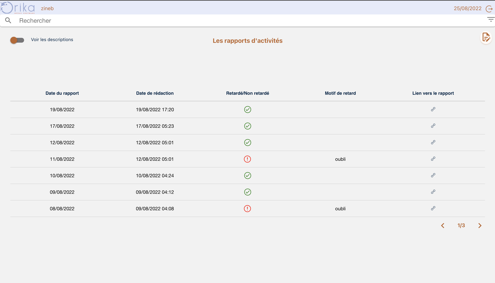
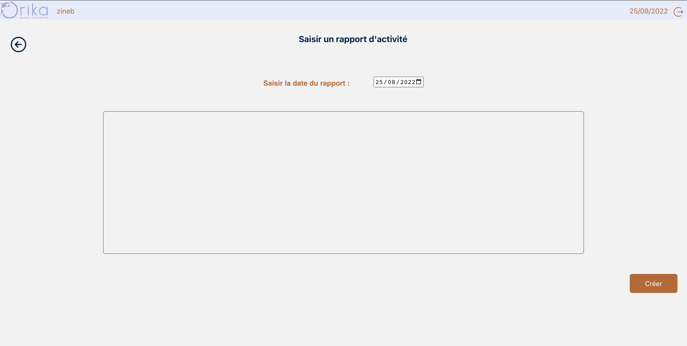
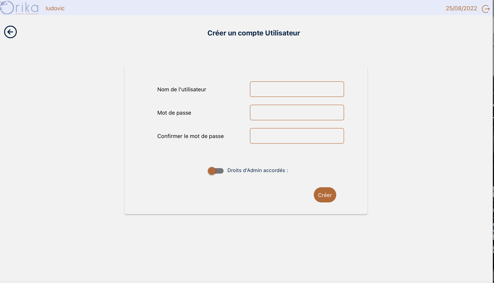
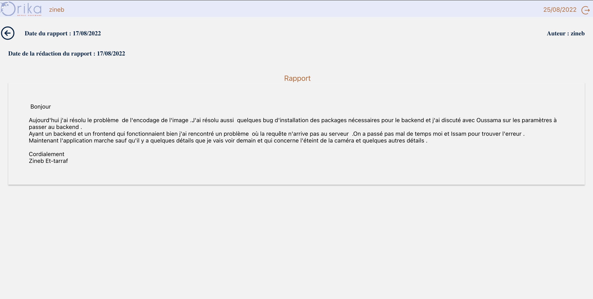

# Web application for activity reports : o4act

## Specifications :

Indeed, employees, in particular the trainees, who potentially work on various subjects will have to send an activity report to their managers at the end of each day. A report summarizing the tasks completed during the day as well as an action plan for the next tasks.
Sending these reports by email makes it difficult for managers to follow them up, as they are mixed in with dozens or even hundreds of other emails. This is where the idea came from to create a web application that we named o4act and that allows employees to enter activity reports and managers to more easily follow up on the reports as well as the delay and non-delay of the entries.
This application also offers an advanced search filter. It is an application that offers almost the same functionalities as webmail.

## Demo of o4act :

<em>The o4act login screen</em>

<em>The home screenn</em>

<em>Activity report entry screen</em>

<em>The screen to add a user, this screen is only accessible in the admin account</em>

<em>Quickly hide and show reports using the top left button.</em>

